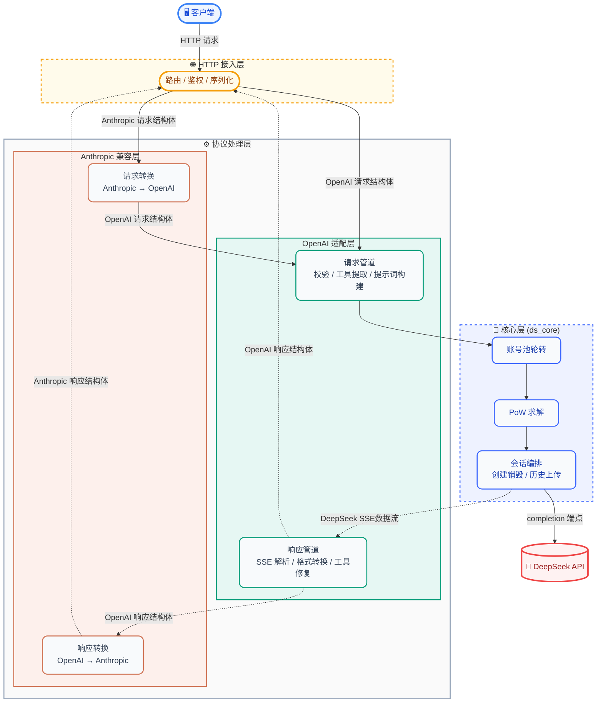
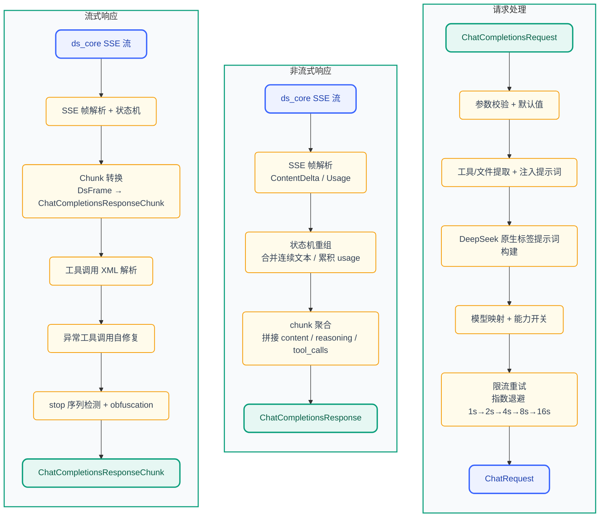
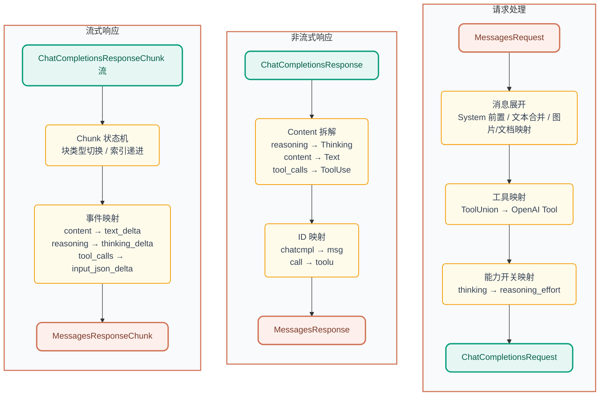

<p align="center">
  
</p>

<h1 align="center">DS-Free-API</h1>

<p align="center">
  <a href="LICENSE"></a>
  
  
  
</p>
<p align="center">
  
  
  
</p>

[English](README.en.md)

将免费的 DeepSeek 网页端对话反代并适配转换为标准的 OpenAI 与 Anthropic 兼容 API 协议（目前支持 chat completions 和 messages，包括流式返回与工具调用）。

## 项目亮点

- **零成本 API 代理**：使用 DeepSeek 免费网页端，无需官方 API Key，即可获得 OpenAI / Anthropic 兼容接口
- **幂等重试安全**：支持 `Idempotency-Key` 请求头（Stripe / OpenAI 约定）—— 客户端超时重试
  不会重复打到上游，命中时字节级回放同一响应并标记 `idempotent-replayed: true`
- **三协议支持**：同时兼容 OpenAI Chat Completions、OpenAI Responses（`/v1/responses` + `GET /v1/responses/{id}` 检索）与 Anthropic Messages API，主流客户端即插即用
- **工具调用就绪**：OpenAI function calling 完整实现，工具解析 + 三层自修复管道（文本修复 → JSON 修复 → 模型兜底），覆盖 10+ 异常格式
- **文件上传就绪**：支持 OpenAI `file` / `image_url` content part 和 Anthropic `image` / `document` content block 的内联 data URL 文件自动上传到 DeepSeek 会话；
  HTTP URL 自动触发搜索模式，模型可直接访问链接内容
- **超长提示词回退**：当提示词超过模型限制时，自动使用分块补全 + 文件上传绕过
- **Web 管理面板**：内置可视化面板，账号池状态、API Key 管理、请求日志、i18n 国际化（简体中文 / English / Bahasa Indonesia）、主题切换、响应式布局（桌面 / 平板 / 移动）与 PWA，配置热重载开箱即用
- **Rust 实现**：单可执行文件 + 单 TOML 配置，跨平台原生高性能（Web 面板编译时嵌入，开箱即用）
- **多账号池**：空闲最久优先轮转（DashMap 无锁读），支持水平扩展并发
- **风控对齐（2026-10）**：按官方客户端抓包结果补齐 `x-hif-leim` 风控令牌（按设备缓存）、
  设备身份按账号派生、传输层拟态档位可配（`emulation`，默认与 UA 自洽的原生 App 指纹）、
  单账号滑动窗口配额与禁言早检；诊断入口 `hif_probe` / `account_check` / `identity_probe`

## 快速开始

### 二进制使用

1. 从 [releases](https://github.com/NIyueeE/ds-free-api/releases) 下载对应平台压缩包并解压
2. 复制 `config.example.toml` 为 `config.toml` 并填入账号 (可选, 也可启动后在管理面板中配置)
3. 运行 `./ds-free-api`
4. 访问 `http://127.0.0.1:22217/admin` 设置管理密码，之后可在面板中创建 API Key 和管理账号

```bash
./ds-free-api
./ds-free-api -c /path/to/config.toml
RUST_LOG=debug ./ds-free-api
```

> **并发**：免费 API 有 session 级速率限制。本项目内置限流检测 + 指数退避重试，确保稳定。
> 推荐并行数 = 账号数 / 2。支持无 config.toml 启动后通过管理面板添加账号。

### Docker 使用

```bash
# 首次部署：先准备容器配置（见下方说明）
cp docker/config.example.toml docker/config/config.toml

docker compose -f docker/docker-compose.yaml up -d
```

Compose 配置见 [docker/docker-compose.yaml](./docker/docker-compose.yaml)。

管理面板在 `http://localhost:22217/admin`，首次访问设置管理密码。
`config/` 和 `data/` 目录通过 bind mount 挂载到容器内，配置修改自动持久化到宿主机。

> **首次部署必须准备 `docker/config/config.toml`**（`cp` 上面那一行）。
> 已发布镜像（≤ v0.5.1）在配置缺失时会按代码默认值生成 `host = "127.0.0.1"` 的配置，
> 服务只监听容器内回环，宿主机的 `22217` 端口会**连不上**（容器显示 Up 但访问无响应）。
> 从源码构建的镜像（`docker/Dockerfile` + `docker/entrypoint.sh`）已修复：配置缺失或为空时
> 自动用内置示例（`host = "0.0.0.0"`）初始化，无需手动 `cp`。

### 免费测试账号

请自行注册，可以参考 [issue #62](https://github.com/NIyueeE/ds-free-api/issues/62) 的方法。

> **⚠️ 账号风控现状（2026-09）**：官方风控已大幅收紧，本仓库 README 与 issue 中历史公开的测试账号
> **已全部失效**（`USER_IS_BANNED` / `user is muted` / `RISK_DEVICE_DETECTED`）。这不是项目 bug，
> 而是上游针对共享账号的策略变化：
>
> | 上游返回 | 含义 | 处理方式 |
> |----------|------|----------|
> | `biz_code=10 USER_IS_BANNED` | 账号已被永久封禁 | 无法恢复，只能注册新账号 |
> | `biz_code=5 user is muted` | 临时禁言（响应含 `mute_until`，通常数周） | 无法通过重登恢复，账号会被标记为 `invalid` |
> | `biz_code=11 RISK_DEVICE_DETECTED` | 缺少浏览器设备指纹 | 在账号配置里补上 `device_id`（见下） |
>
> 因此现在**不建议依赖公共测试账号**。请使用自己的账号，并在 `config.toml` / 管理面板中为每个账号
> 填写 `device_id`，否则登录会直接被风控拦截。
>
> **✅ 2026-10 更新：缺失的风控令牌已补齐。** 用真实浏览器抓包发现，官方客户端会在
> `/chat/completion` 请求上带一个由 `hif-leim.deepseek.com` 下发的短期令牌
> （`x-hif-leim`，有效期见响应头 `x-hif-ttl`，默认 600s）。本代理此前完全没有该头，
> 上游无需任何行为统计即可判定请求来自非官方客户端 —— 与「每账号仅 2 次请求也被禁言」
> 的实测现象吻合。v0.5.0 起 `ds_core` 会自动取令牌、按 TTL 刷新并附在 SSE 请求上
> （`hif_enabled = true`，默认开启）。细节见 `docs/development.md`。

#### 如何获取 `device_id`

`device_id` 是数美（Shumei）SDK 生成的设备级指纹。上游用它做账号关联与画像，
因此**每个账号应使用各自独立的 `device_id`**（各自开一个无痕窗口 / 浏览器配置文件登录一次），
不要把同一个值复用到多个账号。⚠️ 该值**不能伪造**（伪造的 base64 或普通字符串会返回
`RISK_DEVICE_DETECTED`），必须来自真实浏览器；取一次长期有效：

1. 用 Chrome 打开 `https://chat.deepseek.com/sign_in` 并登录一次（确保页面完全加载，风控脚本已初始化）
2. 打开开发者工具 → Network，过滤 `users/login`
3. 发起一次登录，查看该请求的 Payload，复制 `device_id` 字段的值
4. 写入账号配置：

   ```toml
   [[ds_core.accounts]]
   email = "you@example.com"
   mobile = ""
   area_code = ""
   password = "your-password"
   device_id = "从浏览器抓到的值"
   ```

   管理面板 → 配置页同样提供该字段的编辑（留空则保留服务端已有值）。

> 简化方案：在浏览器控制台执行 `SMSdk.getDeviceId()`（需等 `SMSdk` 就绪）也能直接拿到该值。

## API 端点

| 方法 | 路径 | 说明 |
|------|------|------|
| GET  | `/`   | 重定向到管理面板 |
| GET  | `/health` | 健康检查 |
| POST | `/v1/chat/completions` | 聊天补全（支持流式与工具调用） |
| POST | `/v1/responses` | OpenAI Responses API（流式 + 工具调用 + `previous_response_id`） |
| GET  | `/v1/responses/{id}` | 检索已保存的 Response 对象（进程内有界 + TTL 缓存；未命中 404） |
| GET  | `/v1/models` | 模型列表 |
| GET  | `/v1/models/{id}` | 模型详情 |
| POST | `/anthropic/v1/messages` | Anthropic Messages（支持流式与工具调用） |
| GET  | `/anthropic/v1/models` | 模型列表（Anthropic 格式） |
| GET  | `/anthropic/v1/models/{id}` | 模型详情（Anthropic 格式） |

管理面板位于 `/admin`，首次访问引导设置管理密码。

所有响应都带 `x-request-id`（形如 `req-1a2b`），与运行日志里的 `req=` 同源，便于对账排障。

### 幂等重试（`Idempotency-Key`）

在 `POST /v1/chat/completions`、`POST /v1/responses`、`POST /anthropic/v1/messages`
上带上 `Idempotency-Key: <任意唯一串>`（SDK 一般会自动生成），语义如下：

| 情况 | 结果 |
|------|------|
| 首次请求 | 正常执行 |
| 相同 key + 相同请求体，且上一条**已结束** | 回放缓存的响应（状态码 / `Content-Type` / 响应体字节一致），响应头带 `idempotent-replayed: true` |
| 相同 key + 相同请求体，上一条**仍在执行** | `409 idempotency_error`（不会穿透到上游） |
| 相同 key + **不同请求体** | `400 idempotency_error`（避免键复用串答案） |
| 上一条被客户端中断，或响应体超过 1MB | 记录作废 → 重试按首次请求处理 |

缓存是**进程内**有界 + TTL 24h（1024 条 / 单条 1MB / 总量 64MB），重启即失效、不落盘。
不带该请求头时行为与普通请求完全一致。

## 模型映射

> **⚠️ 上游已下线 expert / vision（2026-09）**
>
> `/api/v0/client/settings` 的 `model_configs` 明确显示：
>
> | model_type | 名称 | enabled | switchable |
> |------------|------|---------|------------|
> | `default` | 快速模式 | ✅ true | ✅ true |
> | `expert` | 专家模式 | ❌ **false** | ❌ false |
> | `vision` | 识图模式 | ❌ **false** | ❌ false |
>
> 即网页端已不再提供这两个模式的切换入口，**目前实际只有一个模型**。
> 因此本项目默认只暴露 `deepseek-default`。expert / vision 的 API 仍能调用，
> 但上游已标记为 disabled，启用后请求容易失败或行为不稳定。
> 如确需启用，在 `config.toml` 中显式配置 `model_types`。

`config.toml` 中 `model_types`（默认 `["default"]`）自动映射为 `deepseek-<type>`：

| OpenAI 模型 ID     | DeepSeek 类型 |
| ------------------ | ------------- |
| `deepseek-default` | 快速模式      |

**模型名可以直接用裸名**：`default`（大小写不敏感）等价于 `deepseek-default`，
方便 Claude Code / Codex 等把 `model` 设成简短名字的客户端（见 issue #99）。

可选别名通过 `model_aliases` 按 index 对齐 `model_types`，默认无别名。空字符串被跳过：

```toml
# model_types    = ["default", "expert"]
# model_aliases  = ["", "deepseek-v4-pro"]  → deepseek-v4-pro 映射到 expert（index 1）
model_aliases = []
```
Anthropic 兼容层使用相同的模型 ID，通过 `/anthropic/v1/messages` 调用。

### 能力开关

- **深度思考**：默认已开启。如需显式关闭，请求体中加 `"reasoning_effort": "none"`。
- **智能搜索**：默认已开启（DeepSeek 后端在搜索模式下会注入更强的系统提示词，提升工具调用遵循度）。如需显式关闭，请求体 中加 `"web_search_options": {"search_context_size": "none"}`。
- **文件上传**：支持内联文件（data URL）自动上传到 DeepSeek 会话，以及 HTTP URL 自动触发搜索模式：

  **OpenAI 端：**
  ```json
  {"type": "file", "file": {"file_data": "data:text/plain;base64,...", "filename": "doc.txt"}}
  {"type": "image_url", "image_url": {"url": "data:image/png;base64,..."}}
  {"type": "image_url", "image_url": {"url": "https://example.com/img.jpg"}}
  ```

  **Anthropic 端：**
  ```json
  {"type": "image", "source": {"type": "base64", "media_type": "image/png", "data": "..."}}
  {"type": "document", "source": {"type": "base64", "media_type": "text/plain", "data": "..."}}
  {"type": "image", "source": {"type": "url", "url": "https://example.com/img.jpg"}}
  ```

### 工具调用标签幻觉

内置模糊匹配（全角 `｜`<=>`|`、`▁`<=>`_`），自动覆盖大多数变体。若模型输出格式不同的回退标签，可在控制面板中添加, 或者在 `config.toml` 的 `[ds_core]` 下追加：

```toml
tool_call.extra_starts = ["<|tool_call_begin|>", "<tool_calls>", "<tool_call>"]
tool_call.extra_ends = ["<|tool_call_end|>", "</tool_calls>", "</tool_call>"]
```

## Web 管理面板

启动服务后访问 `http://127.0.0.1:22217/admin` 即可进入管理面板：

- **概览**：请求统计、账号池状态一览（移动端自动切换为卡片式布局）
- **账号池**：查看/添加/移除账号（含 `device_id` 字段），手动重新登录 Error 状态账号
- **API Keys**：创建/删除 API Key，脱敏展示
- **模型**：可用模型列表与详情，内置 cURL / Python / Node.js 调用示例
- **配置**：账号、API Key、模型类型、工具调用标签等核心配置
- **设置**：Server / Proxy / ds_core 客户端参数，以及管理员密码修改
- **日志**：最近请求日志与运行时日志

界面支持三语切换（简体中文 / English / Bahasa Indonesia）、明暗主题（跟随系统 / 亮 / 暗）、
侧边栏折叠（状态持久化到 `localStorage`），并可作为 PWA 添加到桌面/主屏。

<p align="center">
  
  <br>
  <em>管理面板概览（Dashboard）</em>
</p>

<p align="center">
  
  <br>
  <em>配置界面（Config）</em>
</p>

首次访问时引导设置管理密码（bcrypt 哈希存储），登录后签发 JWT（24h 有效），支持密码重置时吊销旧 Token。

## 环境变量

| 变量 | 默认值 | 说明 |
|------|--------|------|
| `RUST_LOG` | `info` | 日志级别（`trace` / `debug` / `info` / `warn` / `error`） |
| `DS_DATA_DIR` | `.`（当前目录） | 数据目录，存放 `logs/runtime.log` 和 `stats.json` |
| `DS_CONFIG_PATH` | `./config.toml` | 配置文件路径，优先级低于 `-c` 参数 |

## 安全

- **管理面板**：JWT 认证 + bcrypt 密码哈希 + 登录失败率限制（5 次失败锁定 5 分钟）
- **API 访问**：通过管理面板创建的 API Key 鉴权（HashSet O(1) 查找）
- **CORS**：可配置允许的 Origin 列表，默认仅 `http://localhost:22217`
- **敏感信息**：账号 ID 在响应头中脱敏，请求体不记录日志，持久化文件权限 0600

## 开发

### 设计哲学

**一个 `config.toml` 反映所有运行状态**。管理面板对配置的修改即时持久化到 `config.toml`，同时热重载到运行中的服务。

**非必要不引入额外运行时系统依赖**。项目始终优先选择纯 Rust 或静态链接的依赖（如 `rustls` → `wreq` + BoringSSL），确保编译产物单一二进制无外部 `.so`/`.dll` 依赖，下载即用。


### 简要架构图：



### 数据管道：

#### OpenAI (chat_completions) 处理管道:



#### Anthropic (messages) 处理管道:



详细开发指南（构建、测试、Docker 部署、e2e 测试等）见 [docs/development.md](./docs/development.md)。
## 许可证

[GNU General Public License v3.0](LICENSE)

[DeepSeek 官方 API](https://platform.deepseek.com/top_up) 非常便宜，请大家多多支持官方服务。

本项目的初心是想体验官方网页端灰度测试的最新模型。

**严禁商用**，避免对官方服务器造成压力，否则风险自担。
